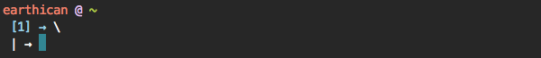

# osx-shell-prompts
A collection of code snippets customize your shell prompt

# Current Prompt Display

```bash
export PS1="$RED\u $PURPLE@ $GREEN\w $GREENBOLD\$(git rev-parse --abbrev-ref HEAD 2> /dev/null)\n $BLUE[\#] → $RESETCOLOR"
export PS2=" | → $RESETCOLOR"
```


## Colors
```bash
local BLACK="\[\033[0;30m\]"
local BLACKBOLD="\[\033[1;30m\]"
local RED="\[\033[0;31m\]"
local REDBOLD="\[\033[1;31m\]"
local GREEN="\[\033[0;32m\]"
local GREENBOLD="\[\033[1;32m\]"
local YELLOW="\[\033[0;33m\]"
local YELLOWBOLD="\[\033[1;33m\]"
local BLUE="\[\033[0;34m\]"
local BLUEBOLD="\[\033[1;34m\]"
local PURPLE="\[\033[0;35m\]"
local PURPLEBOLD="\[\033[1;35m\]"
local CYAN="\[\033[0;36m\]"
local CYANBOLD="\[\033[1;36m\]"
local WHITE="\[\033[0;37m\]"
local WHITEBOLD="\[\033[1;37m\]"
local RESETCOLOR="\[\e[00m\]"
```

## Special Characters
```bash
\a # an ASCII bell character (07)
\d # the date in “Weekday Month Date” format (e.g., “Tue May 26”)
\D{format} # the format is passed to strftime(3) and the result is inserted into the prompt string; an empty format results in a locale-specific time representation. The braces are required
\e # an ASCII escape character (033)
\h # the hostname up to the first part
\H # the hostname
\j # the number of jobs currently managed by the shell
\l # the basename of the shell’s terminal device name
\n # newline
\r # carriage return
\s # the name of the shell, the basename of $0 (the portion following the final slash)
\t # the current time in 24-hour HH:MM:SS format
\T # the current time in 12-hour HH:MM:SS format
\@ # the current time in 12-hour am/pm format
\A # the current time in 24-hour HH:MM format
\u # the username of the current user
\v # the version of bash (e.g., 2.00)
\V # the release of bash, version + patch level (e.g., 2.00.0)
\w # the current working directory, with $HOME abbreviated with a tilde
\W # the basename of the current working directory, with $HOME abbreviated with a tilde
\! # the history number of this command
\# # the command number of this command
\$ # if the effective UID is 0, a #, otherwise a $
\nnn # the character corresponding to the octal number nnn
\\ # a backslash
\[ # begin a sequence of non-printing characters, which could be used to embed a terminal control sequence into the prompt
\] # end a sequence of non-printing character
```

## Acknowledgements
* [Alex Dobson](https://github.com/SufferMyJoy) for his [blog post and code snippets](http://dobsondev.com/2014/02/21/customizing-your-terminal/)
